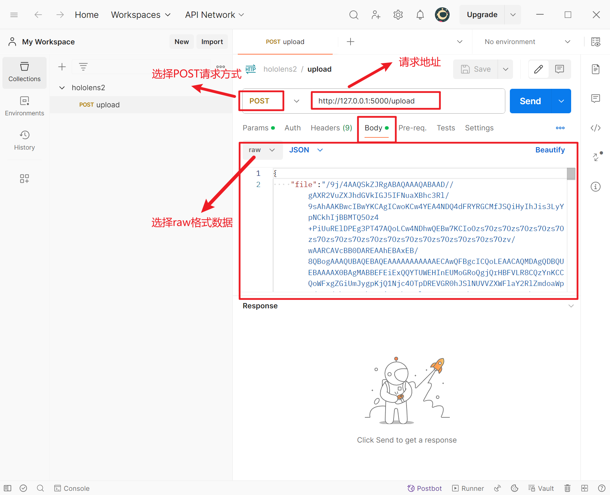
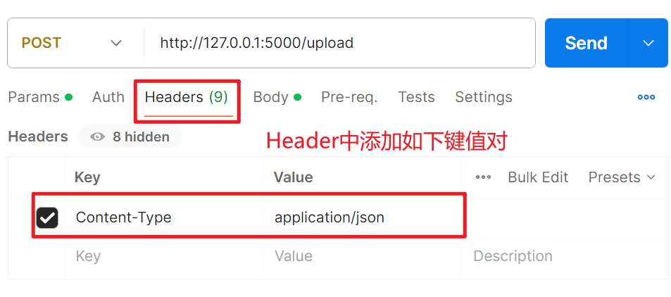
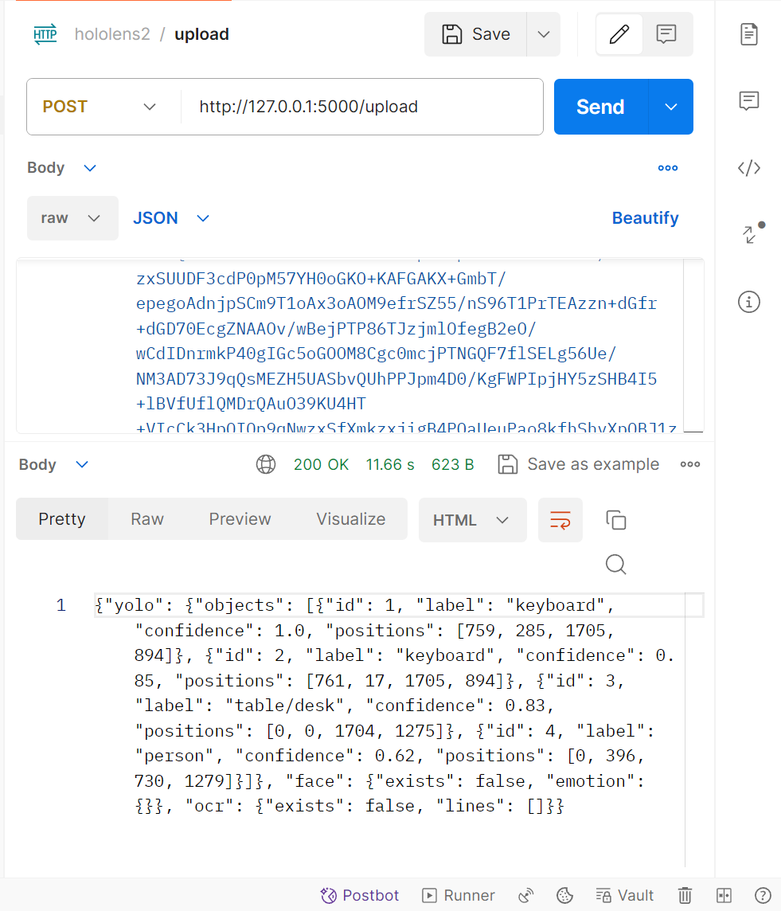

# hl2_online_project

## 使用方法

### 基本操作方法

1. 将Release中的`weights.zip`权重文件下载后解压到`yolo/`文件夹下的`weights`文件夹中

2. 安装项目依赖：`pip install -r requirments.txt`

3. 启动Flask APP：`python app/app.py -p|--port 5000`

   > 程序需要传入参数：`--port | -p [端口号]`
   >
   > 指定Flask后端应用启动端口（为后续GUI设计时使用）

4. 使用Postman工具发送POST请求进行功能测试

   

   

   > 请求地址填写为：`http://127.0.0.1/upload`
   >
   > 在Header中添加键值对：`Content-Type : application/json`
   >
   > 在Body中选择`raw`格式数据，填写请求数据

5. json请求数据的填写

   > json请求数据中需要填入file字段，值为图片文件二进制编码的base64编码后的字符串

   使用`test/img2txt.py`脚本能够将指定的图片文件转换成上述的json请求数据，使用方式是运行如下脚本：

   `python img2txt.py -f|--file path/of/image [-o|--output /path/of/txt]`

   （-o参数可以省略，省略后输出与图片相同路径和文件前缀名的.txt文件）

   将生成的**txt文件**中的数据复制到**Body**中填写，点击**Send**发送请求

6. 请求响应

   

### 响应数据格式

```json
{
    "yolo": {  //目标检测部分
        objects: [ //识别到多个物体或者未识别到物体
            {
                "id": int,
                "label": str,  //类别标签（中文）
                "positions": [x1, y1, x2, y2], //边界框
                "confidence": float,  //置信度
            },
            
        ]
    },
    "face": {  //人脸检测部分
        "exists": bool,  //是否检测到人脸（未检测到时下面的emotion为空）
        "emotion": {
            "label": str,  //情绪类别（中文）
            "confidence": float  //置信度
        }
    },
    "ocr": {  //文字识别部分
        "exists": bool,  //是否检测到手势（未检测到时下面的lines为空）
        "lines": [
            {  //每一行文字
                "line": str,  //文字
                "position": [[x1, y1], [x2,  y2], [x3, y3], [x4, y4]],  //位置（4个点的坐标，构成四边形）
                "confidence": float  //置信度
            }
        ]
    }
}
```

## 项目测试

`test`文件夹中包含多个功能的测试脚本

- `test/test_cap.py`：读取摄像头图片帧数据，向后端接口发送请求
- `test/test_detector.py`：测试识别本地的一张图片
- `test/img2txt.py`：将图片数据转换成请求数据

## 项目进展

- [x] 完成Yolo、OCR、表情识别功能集成
- [x] 使用Flask完成后端应用接口
- [x] 设计GUI可视化界面（包含实时图片显示）
- [ ] 尝试部署仅包含摄像头的边缘设备
- [ ] 完成Hololens2部分应用集成
- [ ] 将SLAM建图集成在服务器端程序